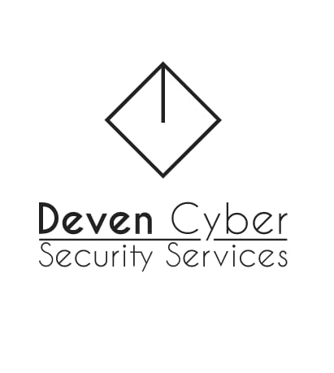

## DEVSECURE
### Description
# Secure IoT Device Authentication and Management Platform

## Table of Contents
- [Introduction](#introduction)
- [Features](#features)
- [System Architecture](#system-architecture)
- [Technology Stack](#technology-stack)
- [Getting Started](#getting-started)
- [Installation](#installation)
- [Usage](#usage)
- [API Documentation](#api-documentation)
- [Security](#security)
- [Contributing](#contributing)
- [License](#license)

## Introduction

The Secure IoT Device Authentication and Management Platform is a robust solution designed to enhance the security and management of IoT devices in the connected world. This README.md provides essential information for getting started with the platform.

## Features

- User Authentication and Authorization
- Multi-Factor Authentication (MFA)
- Vulnerability Scanning
- Blockchain-Based Device Identity Registry
- Real-time Threat Alerts
- User Training and Support
- Data Privacy and Security

## System Architecture

The platform follows a microservices architecture to provide scalability and flexibility. Key components include authentication services, vulnerability scanning, blockchain integration, user training, and more.

## Technology Stack

The technology stack used in this project includes:

- **Backend Development:** Node.js, Express.js
- **Frontend Development:** React
- **Database Management:** PostgreSQL, Ethereum (Blockchain)
- **Containerization:** Docker
- **Container Orchestration:** Kubernetes
- **Authentication and Security:** Passport, JSON Web Tokens (JWT), bcrypt
- **Encryption and Data Privacy:** TLS, data encryption
- **Real-time Communication:** WebSockets
- **Cloud Hosting:** AWS, Azure, GCP
- **DevSecOps Tools:** OWASP guidelines, static analysis tools
- **Documentation and Collaboration:** Confluence, Jira

## Getting Started

### Installation

1. Clone the repository.
   
   git clone https://github.com/EDGARDEVEN/DEVSECURE.git
   cd secure-iot-platform

2. Install dependancies
    npm install

3. Usage
    Set up your configuration files.
    Create a .env file for environment variables.
    Configure your database connection and secret keys.

4. Start The Server
    npm start

5. Access the platform
    http://localhost:3000

## Using Docker
1. Install Docker
    https://docs.docker.com/get-docker/
2. Clone the repository
    git clone
3. CD into the directory
    cd DEVSECURE
4. Run the docker-compose file
    docker-compose up
5. Access the platform
    http://localhost:3000

## API Documentation
    For detailed API documentation, refer to the API Documentation file.

## Security
    Security is a top priority for our platform. We follow industry best practices and regularly conduct security assessments to ensure the integrity and confidentiality of user data. If you discover a security vulnerability, please report it to edgardeven303@gmail.com.

## Contributing
    We welcome contributions from the community. If you'd like to contribute to the development of the platform, please follow our Contribution Guidelines.

## License
    This project is licensed under the MIT License.